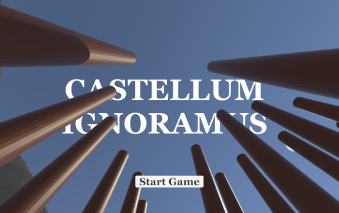
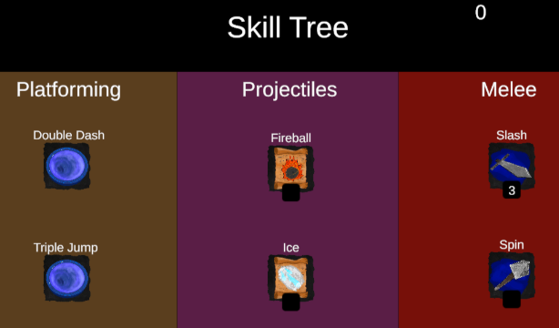

Our game is a combat platformer titled “Castellum Ignoramus.” As someone who’s just recently joined the ranks of sorcerers, you’ve come to this hidden city to track down Ignoramus the Wizard’s famous scrolls. These scrolls have been lost to time and can be revealed by obtaining gems.

### Gameplay Description:

You have 4 combat abilities:

* Fireball: This is a powerful spell that does great damage but costs high stamina to use. It is bound to the “1” key, where Mouse1 will shoot and you can optionally aim with Mouse2.  
* Ice: This is a weak but cheap spell that any experienced or inexperienced sorcerer can spam at their leisure. It is bound to the “2” key, where Mouse1 will shoot and you can optionally aim with Mouse2.   
* Slash: This is your starting ability. It’s weak, it’s slow, but it’s enough to get the job done in the first moments of the game. To attack, press Mouse1 when the slash ability is selected and when an enemy is in front of you.  
* Spin: The spin is a risky but valuable tool. At the risk of taking significant damage from your foes, you can deal just as much damage by spinning and taking out an area around you. This ability is bound to the “4” key and subsequently Mouse1.

Aside from Slash, these abilities aren’t free, however. You will have to explore to find enough skill points to pick and choose from our Skill Tree (press P). Here, you can spend your gems to purchase the aforementioned skills and more.  

Your goal is to traverse the crumbling city, arrive at Ignoramus’s rise and claim his knowledge for yourself. The road will not be easy, in fact it will be filled with platforming challenges and precarious jumps. Only those willing to meet the task will receive Ignoramus’s wisdom.  

