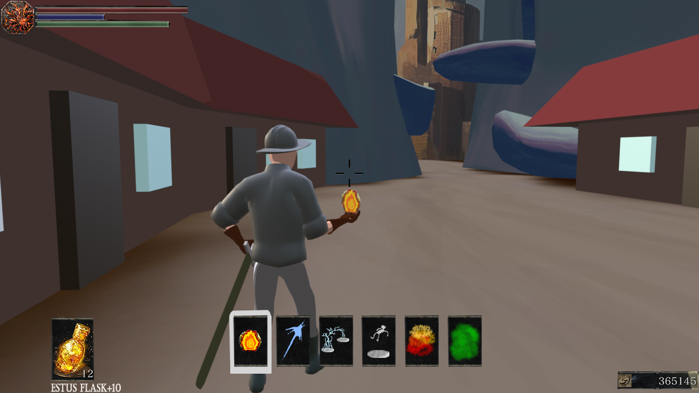

# Castellum Ignoramus

## Final Project Design Document

# Gameplay Description

## Core Mechanic:

The core mechanic of our game is exploration and combat encouraged by platforming abilities.

The player will fight residents of a decrepit land with a variety of tools found through exploration or purchasable skills. These tools will vary between platforming, melee, and projectile abilities. There will be two modes of combat: locked/ADS or open. Some enemies will be impervious or resistant to projectiles, forcing the player to approach carefully by locking on or “aiming down sights” to enter a different mode of gameplay. While the player can perform platforming abilities in open combat, this closer, more precise mode will use different abilities.

Traversing the world would include checkpoints, optional paths, and leveling. The checkpoints will behave similar to bonfires, providing safety while also resetting the enemies in the area. They will allow teleportation between them to access earlier areas and NPCs.

## The Skill Tree:

When a button on the keyboard is pressed, the game will pause, and the entire screen will change. The new screen will be titled "Skill Tree," which will be centered at the top. The number of skill points the player currently has will be displayed to the right of the title. Below the title, there will be three categories: Movement, Magic, Ranged, and Miscellaneous. Each category will feature different skills. The skills, along with their upgrades, are listed below. Each skill will have an associated image and a number indicating how many skill points are required to unlock it. Additionally, a lock icon will be displayed in the center of all non-unlocked skills images.

Under the skills, there will be a blank area that includes detail and buy buttons. When a skill is selected, the details section will provide a quick description of the skill and the number of points needed to unlock it. If the player has enough points, the buy button will be red; otherwise, it will be grey.

Potential Abilities:

* Projectiles  
  * Fireball  
  * Chain Lightning  
    * Projectile that chains between nearby enemies  
  * Magic Missile  
    * Homing projectile  
  * Lightning Shift  
    * Teleports forward as a long dash and strikes enemies in between with lightning  
* Platforming  
  * Dash  
  * Double Jump  
  * Launch  
  * Hover  
  * Wall Run (?)  
* Melee  
  * Spin  
  * Ground Slam  
  * Pierce  
  * Push

## Input:

We will use Keyboard and Mouse, where you will use the mouse to aim projectiles, and use the keyboard to select and use abilities. Additionally, you can lock onto enemies to allow for a more comfortable control experience when fighting a specific enemy rather than a group.

* WASD \- Movement  
* Left Click \- Attack/Fire  
* (Hold) Right Click \- ADS  
* CTRL \- Lock On  
* SHFT \- Dash

Surrounding keys such as:

* 1-5, E, Q, R, F, C, X

Can be used for abilities or inventory management

## Audio/Music:

Since neither me nor Chris have worked on creating music before, the game will likely not have any. If we are lucky, we aim to have ambient sounds, effects such as footsteps, weapons, and abilities, and dialogue.

## UI

	In this image, you can see a mockup of what gameplay (hopefully) will look like, and several UI elements

* Health, mana, stamina  
* Dark Souls III Estus Flask \+10 (this is healing, we’d change it obviously)  
* The icons in the center represent potential spells that we are working on. They range from projectiles to platforming abilities. They would need to be displayed somehow on the screen for the player to select among.  
* Finally, the bottom right has the Dark Souls III Souls counter. Similarly, in our game, experience points and currency will be tied together, and can be lost upon death if you do not successfully retrieve it.  
* The background is a quick model of what a world with platforming challenges and regular exploration might look like.

## Visual Style

As you can see in the above Blender representation, the style would be non-photorealistic. As we did not cover graphics, different styles like “painterly” or “toon shaders” will be explored in the future. But as it stands, the current artstyle is simple image textures.

## Story/Theme

You are a distant traveler infringing on the land of Ignoramus. You’ve received the call echoed by his death. Those who can traverse the dangerous land and scale Ignoramus’s domain will be the inheritor of his power and knowledge. As an aspiring mage and combatant, there is no greater honor.

The story takes place in a medieval fantasy setting with magic, sword combat, and non-modern or futuristic elements.

# The Low Bar

The Low Bar is to have a working combat system with a handful of abilities/spells, comfortable platforming controls, and varied enemies. For the world/level design, the low bar would be to have at least one in depth level for the player to explore, whether it’s the titular Ignoramus’s tower or not. The game should still incorporate leveling, checkpoints, and a legible visual style.

# The Target

	  
The target is to have the two modes of combat work seamlessly while having a small but intricate level. We want to have a skill tree that provides different choices but understand that coming up with and developing tens of skills is unreasonable in 3 weeks. We hope to have implemented an inventory system to encourage exploration and give reason for the merchants’ existence. 

# The High Bar

The High Bar is to have a complete world with multiple levels. A finished skill tree with different avenues for replayability. Perfect transitions and functionality of the two different modes of combat. We plan to have NPCs who relocate depending on the player’s progress. These include regular exposition deliverymen or merchants. We also plan to have a final boss atop the rise.

# Timeline

### December 3rd:

Working controls and camera that demonstrate the switching gameplay modes function. This phase is to prove that the concept is possible and fun to play.

### December 6th:

Combat implemented with smart enemy AI and at least one or two abilities that alter depending on the gameplay mode. The introductory elements of the first level.

### December 10th:

Complete first level with optional paths and a main path with varied enemies and at least 3 or 4 different abilities.

### December 13th: 
Minimal bugs, comfortable controls, varied enemies, varied abilities, and sound design in time for the final submission and playtest.

